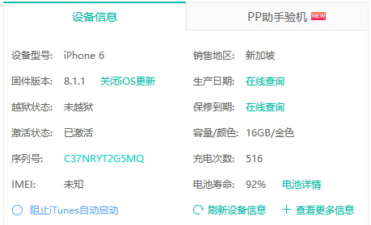
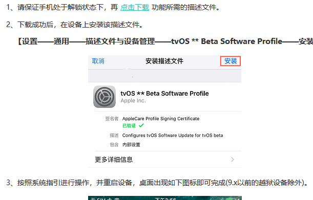
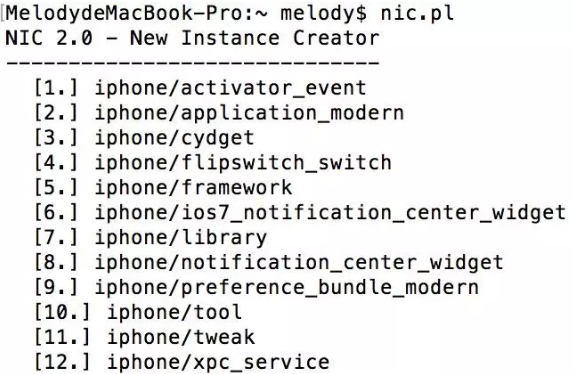

__阅读本文档时请参考文末说明__

# 手机越狱

## 系统信息：8.1.1

## 机型：iPhone6



## 越狱及修复闪退

- [越狱及修复闪退（参考）](http://jailbreak.25pp.com/jiaocheng/yueyu_69128.html)(ios8不再适用)

- 越狱前务必在设备”设置”—“iCloud”—关闭“查找我的iPhone”

- 越狱前务必在设备”设置”— ”Touch ID与密码”— ”关闭密码”

- [使用太极越狱](http://www.taig.com/)

- [使用叉叉助手越狱](jb.xxzhushou.cn)

- [ios9解决cydia闪退的问题的可能办法](http://bbs.25pp.com/thread-515571-1-1.html)

    进去https://jbme.qwertyoruiop.com这个网站，然后点击 go，等待几秒，出现对话框，all set后，点OK关闭对话框，锁屏等待即可恢复越狱。建议保存到桌面，没有网络时也可以打开。会在Safari中存储630kb的文件的，能看懂英文的都能懂，如果失败了多试几次，931亲测通过。这是利用Safari的漏洞，从网页执行了相同的代码实现的.


## 关闭ios更新




# 安装越狱工具

## `Cydia`商店安装内容（务必全部安装）

`Cycript`、`MTerminal`、`OpenSSH` (默认密码为`alpine`,可输入命令`passwd`进行修改)、 `iFile`、`syslogd to /var/log/syslog`、`Class Dump`、`APT 0.6 Transitional`、`ipa installer`

- 'PLUTIL': {'COMMAND': 'plutil', 'PACKAGES': ['com.ericasadun.utilities']（待商榷）

## 安装`debugserver`
        
- 将iPhone连接xcode并在`window->device`中添加，可在iPhone的`Developer/usr/bin`目录下找到debugserver，将debugserver拷出到OSX的`/path/to/debugserver`下
- 给debugserver瘦身(iPhone6 arm64架构)

    `lipo -thin arm64 /path/to/debugserver -output /path/to/debugserver`

    下载[ent.plist](http://iosre.com/ent.plist)到`/path/to/debugserver`下并运行：

    `codesign -s - --entitlements /path/to/ent.plist -f debugserver`
- 将处理过的debugserver拷回至iPhone的`/usr/bin`目录下并**赋予执行权限**

## 安装`Clutch`

- 下载[Clutch](https://github.com/KJCracks/Clutch/releases)的最新release版本
- 将`Clutch`拷贝至iPhone终端的`/usr/bin/Clutch`(注意要改成`Clutch`)目录下并**赋予执行权限**

## 安装[`Frida`](https://www.jianshu.com/p/a01970fdaac1)(未详细安装)

- 打开cydia添加源：http://build/frida.re
- 安装frida
    
## 安装gdb

- 添加源`cydia.radare.org`
    
    

# 电脑端环境配置

## [安装java8及环境变量配置](https://blog.csdn.net/irokay/article/details/71374426)

## [下载ida](https://xclient.info/s/hex-rays-ida-pro.html)

## [theos安装方法](https://www.jianshu.com/p/d8a7e0381ff7)

- 安装`xcode`和`commandline`工具

- 安装homebrew

    ```sh
    /usr/bin/ruby -e "$(curl -fsSL https://raw.githubusercontent.com/Homebrew/install/master/install)"
    ```

- `sudo git clone --recursive https://github.com/theos/theos.git /opt/theos`

- `sudo chown $(id -u):$(id -g) /opt/theos`

- 编辑`~/.bash_profile`(如果没有先创建一个),在末尾加入如下内容

    ```
    # set theos
    export THEOS=/opt/theos
    export PATH=/opt/theos/bin/:$PATH`
    ```
- `source ~/.bash_profile`

- `nic.pl`测试是否安装成功

    

- 更新theos

    `git submodule update –recursive`

## 其他配置

- 安装[python2](https://www.python.org/downloads/)(最新的python2版本，不要安装python3，如果系统已经预装python2则可忽略)

- 安装pip
    ```
        curl https://bootstrap.pypa.io/get-pip.py -o get-pip.py

        sudo python get-pip.py
    ```
- 更新`pip`版本

    `sudo pip install --upgrade pip`

- 生成requirements.txt并安装requirements.txt中描述依赖
    `sudo pip install pipreqs`

    `pipreqs ./`

    `sudo pip install -r /path/to/requirements.txt`

- [安装nessus](https://testerhome.com/topics/4006)

    需要配置`nessus.py`的用户名和密码

# 代码配置

- `para_config.conf`中`[mobile]`部分需要配置

- `nessus.py`的用户名和密码分别设为‘admin’ 和 ‘password’

# 静态引擎配置
    
- conf/path_config.properties:1 需要配置ida的位置

- IDAPython/IDAPython_sqlite.py 需要配置规则文件路径rule_dir

- 可执行程序的依赖为conf、rule和IDA文件夹

# 说明

- “`/path/to/requirements.txt`”表示`requirements.txt`文件的路径,需要确保可达

- “`/path/to/debugserver`下”表示debugserver所在目录

- 如何将tool拷贝至iPhone客户端

    可采用ifunbox工具或使用scp工具
- 如何赋予执行权限：

    - 将电脑端和iPhone客户端连接至同一局域网内（电脑端需安装`ssh`工具）
    = 执行`ssh root@ip`（其中`ip`为此时iPhone客户端的ip地址），输入密码（初始密码为`alpine`）
    - `cd /usr/bin`进入目录下，以Clutch这个可执行程序为例，执行`chmod a+x Clutch`